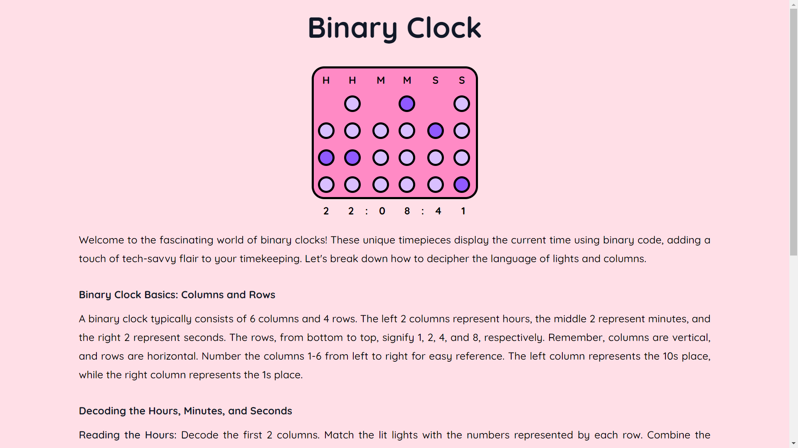

# Binary Clock

This project is a simple webpage created using Angular that displays a functional binary clock. The webpage provides information on how the binary clock represents time and how to read the time from it.

## Table of Contents

- [Introduction](#introduction)
- [Features](#features)
- [How to Run](#how-to-run)
- [Binary Clock Explanation](#binary-clock-explanation)
- [Screenshots](#screenshots)
- [Live Demo](#live-demo)
- [Contributing](#contributing)
- [License](#license)

## Introduction

This Angular project is designed to showcase a binary clock and educate users on how to interpret time using the binary clock format. The project aims to provide a simple and interactive way for users to understand the underlying principles of binary time representation.

## Features

- Functional binary clock
- Information on how to read time from a binary clock
- Angular components for easy customization

## How to Run

Follow these steps to run the project locally:

1. Clone the repository: `git clone https://github.com/sanbinary/BinaryTime.git`
2. Navigate to the project directory: `cd BinaryTime`
3. Install dependencies: `npm install`
4. Run the development server: `ng serve`
5. Open your browser and visit: `http://localhost:4200/`

## Binary Clock Explanation

The binary clock represents time using a binary number system. The clock has separate columns for hours, minutes, and seconds, each represented in binary format. Understanding the binary clock involves interpreting the on/off status of each LED (Light Emitting Diode) in each column.

For a detailed explanation, please refer to the [Binary Clock Wikipedia Page](https://en.wikipedia.org/wiki/Binary_clock)

## Screenshots

## Live Demo

Explore the live demo: [Binary Clock Live Demo](https://main--aquamarine-bonbon-776b3c.netlify.app)

## Thanks

Thanks to CHATGPT for generating this README.md file! If you have any questions or feedback about this website, please feel free to contact us. We welcome all feedback and suggestions!

## Contribution

Contributions are welcome! If you have any ideas for improvements or find any issues, please open an issue or submit a pull request.

## License

This project is licensed under the MIT License - see the [LICENSE](LICENSE) file for details.
